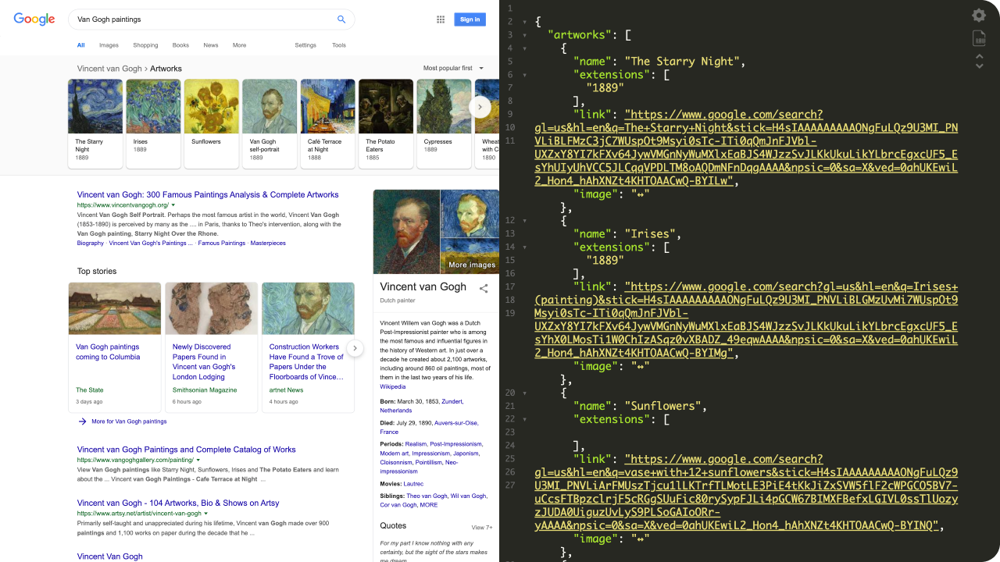

# 👨‍🎨 Van Gogh Paintings

Coding challenge for [SerpApi](https://serpapi.com). A demo is available at [vangogh.doceazedo.com](https://vangogh.doceazedo.com/paintings) for your convenience. 🎨



## Getting started

To start the server, run:

```sh
$ bin/rails server
```

The challenge endpoint will be available at http://127.0.0.1:3000/paintings.

To run the test cases, run:

```sh
$ bin/rails test
```

> [!TIP]
> Most relevant parts of the code for reviewing are the [PaintingsController](app/controllers/paintings_controller.rb) and [PaintingsControllerTest](test/controllers/paintings_controller_test.rb).

## Requirements

- [x] Parse HTML from provided Google result page
- [x] Parse thumbnail images from carrousel
- [x] Include test cases
- [x] Return response similar to the [provided JSON](files/expected-array.json)

## Final thoughts

I have limited experience with Rails, so this was a fun way to get some practice! Any feedback on the code would be awesome :)

I couldn't find any other Google search results with that kind of carousel to add to the app. Maybe it's been removed since this challenge is a bit old.
